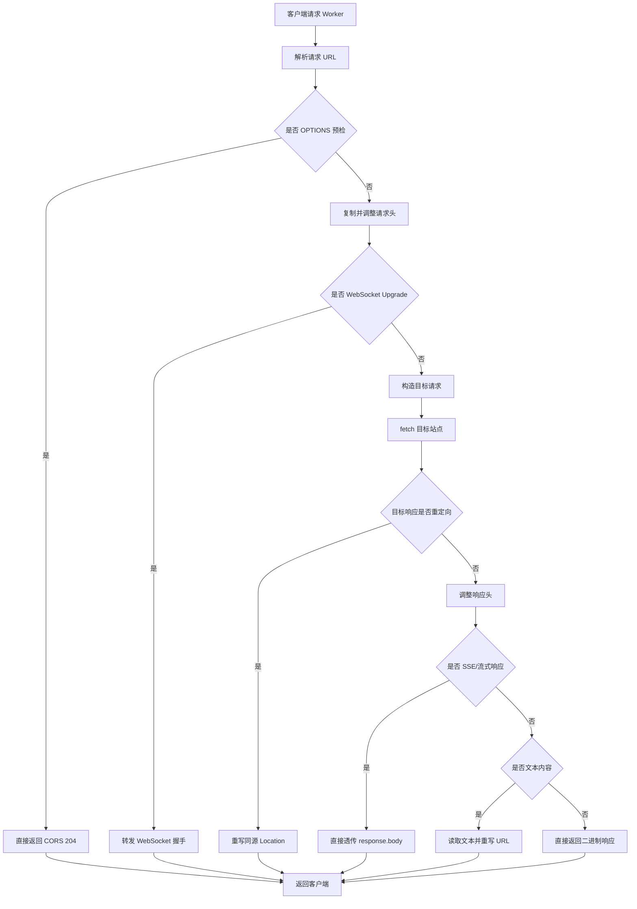

# Any-Proxy 技术文档

## 1. 项目概览

Any-Proxy 是一个基于 Cloudflare Worker 的反向代理项目。Worker 接收客户端请求后，将请求转发到目标站点，再把目标站点响应返回给客户端。

当前代码中的默认目标站点为：

```javascript
const TARGET_HOST = 'anyrouter.top';
const TARGET_URL = `https://${TARGET_HOST}`;
```

项目采用 Cloudflare Worker 的 Service Worker 语法，即通过 `addEventListener('fetch', ...)` 监听请求。入口文件由 `wrangler.toml` 指向 `worker.js`。

## 2. 文件结构

```text
.
├── README.md
├── docs/
│   └── TECHNICAL.md
├── package.json
├── test/
│   └── worker.test.js
├── worker.js
└── wrangler.toml
```

核心文件说明：

- `worker.js`：代理逻辑实现，包括请求转发、请求头调整、重定向处理、响应头处理、URL 重写和长连接透传。
- `wrangler.toml`：Cloudflare Wrangler 配置，声明 Worker 名称、入口文件和兼容日期。
- `package.json`：本地测试脚本配置，当前使用 Node.js 内置测试框架。
- `test/worker.test.js`：自动化测试，覆盖代理核心行为。
- `README.md`：面向使用者的项目简介与部署说明。
- `docs/TECHNICAL.md`：面向维护者的技术说明。

## 3. 运行环境

项目运行在 Cloudflare Workers 平台，主要使用 Workers Runtime 提供的 Web 标准 API：

- `Request`
- `Response`
- `Headers`
- `URL`
- `fetch`
- `ReadableStream`
- Workers Runtime 的 `Response.webSocket`

当前仓库没有第三方运行依赖。部署可以通过 Cloudflare Dashboard 手动粘贴代码，也可以使用 Wrangler。自动化测试使用 Node.js 内置 `node:test`。

## 4. 请求处理流程

完整处理入口在 `handleRequest(request)`。

请求流如下：



## 5. 目标 URL 构造

Worker 会保留客户端请求的路径与查询参数：

```javascript
const targetUrl = `${TARGET_URL}${url.pathname}${url.search}`;
```

示例：

```text
客户端访问: https://proxy.example.com/path?a=1
目标请求:   https://anyrouter.top/path?a=1
```

这意味着 Worker 的代理路径与目标站点路径一一对应。

## 6. 请求头处理

代码会复制原始请求头，并做以下调整：

- 将 `Host` 设置为目标域名。
- 如果存在 `Origin`，改为目标站点 origin。
- 如果存在 `Referer`，保留路径和查询参数，但替换为目标站点 origin。

这样做的目的是让目标站点看到更接近原站访问的请求上下文。

需要注意：

- 大部分原始请求头会被转发，但 hop-by-hop headers 和部分 WebSocket 握手头会被清理。
- Cookie、Authorization 等敏感头如果来自客户端，也会随请求转发到目标站点。
- 当前实现没有鉴权、访问控制或目标白名单。

## 7. 请求 body 处理

对于 `GET` 和 `HEAD` 请求，代码不会读取 body。

对于其他请求方法，代码会将 `request.body` 作为流直接传给目标请求：

```javascript
requestOptions.body = request.body;
```

这样可以避免大请求体被完整读入 Worker 内存，也避免请求体内容进入平台日志。

## 8. 响应头处理

目标响应返回后，代码会复制响应头，并统一添加 CORS 相关响应头。对于带 `Origin` 的请求，会回显该 origin 并允许 credentials；没有 `Origin` 时使用 `*`。

```text
Access-Control-Allow-Methods: GET, HEAD, POST, PUT, PATCH, DELETE, OPTIONS
Access-Control-Allow-Headers: *
Access-Control-Expose-Headers: Content-Type, Content-Length, Location
```

代码还会删除以下响应头：

```text
Content-Security-Policy
Content-Security-Policy-Report-Only
X-Frame-Options
```

这样可以降低浏览器拦截代理页面资源加载的概率，但也会削弱目标站点原本的浏览器安全策略。若用于生产环境，应根据实际安全边界重新评估。

## 9. 重定向处理

请求目标站点时，代码使用：

```javascript
redirect: 'manual'
```

这表示 Worker 不自动跟随目标站点重定向，而是手动处理以下状态码：

```text
301, 302, 303, 307, 308
```

当前逻辑：

- 如果 `Location` 指向目标站点同源地址，会改写为代理站点地址。
- 如果 `Location` 指向外部站点，会保持原值。
- 相对路径会按目标站点 origin 解析后再判断是否需要改写。

示例：

```text
目标返回: https://anyrouter.top/login
代理返回: https://proxy.example.com/login
```

## 10. WebSocket、SSE 与流式响应

### 10.1 WebSocket

如果请求头包含：

```text
Upgrade: websocket
```

Worker 会在普通 HTTP 处理前进入 `handleWebSocketProxy`，将握手请求转发到目标站点。目标站点接受握手后，Cloudflare Workers Runtime 会通过 `response.webSocket` 透传 WebSocket 连接。

当前实现不读取、不修改 WebSocket 帧内容，只负责转发握手和连接。这更适合作为反向代理使用。

### 10.2 SSE

标准 SSE 请求通常包含：

```text
Accept: text/event-stream
```

响应通常包含：

```text
Content-Type: text/event-stream
```

代码会把 SSE 识别为流式响应，并直接返回 `response.body`。这可以避免 `response.text()` 等待连接结束，从而保证事件可以持续推送到客户端。

SSE 响应会额外设置：

```text
Cache-Control: no-cache, no-transform
X-Accel-Buffering: no
```

### 10.3 其他流式响应

除 SSE 外，以下 Content-Type 也会直接透传：

- `application/x-ndjson`
- `application/stream+json`
- `application/grpc`
- `application/grpc-web`

如需支持新的流式类型，可以扩展 `STREAMING_CONTENT_TYPES`。

## 11. URL 重写

文本响应会进入 `rewriteUrlsInContent(content, proxyUrl, targetUrl)`。

当前重写规则包括：

1. 将目标站点 HTTP(S) 绝对 URL 替换为代理站点 origin。

```text
https://anyrouter.top -> https://proxy.example.com
http://anyrouter.top  -> https://proxy.example.com
```

2. 将目标站点 WebSocket 绝对 URL 替换为代理站点 WebSocket origin。

```text
wss://anyrouter.top -> wss://proxy.example.com
ws://anyrouter.top  -> wss://proxy.example.com
```

3. 将协议相对 URL 替换为代理站点 hostname。

```text
//anyrouter.top -> //proxy.example.com
```

这可以让 HTML、CSS、JavaScript、JSON、XML 等文本内容里的部分绝对资源地址继续走代理。

代码会先从 `Content-Type` 中提取标准 MIME 类型，例如把 `text/html; charset=utf-8` 规范化为 `text/html`，再判断是否按文本处理。

明确按文本处理的类型包括：

- `text/html`
- `text/javascript`
- `text/ecmascript`
- `text/plain`
- `text/css`
- `text/csv`
- `text/markdown`
- `text/xml`
- `application/javascript`
- `application/x-javascript`
- `application/ecmascript`
- `application/json`
- `application/ld+json`
- `application/importmap+json`
- `application/manifest+json`
- `application/xml`
- `application/xhtml+xml`
- `application/rss+xml`
- `application/atom+xml`
- `image/svg+xml`

此外，`+json` 和 `+xml` 后缀的 MIME 类型也会按文本处理，例如 `application/problem+json`。

以下类型会明确按二进制处理，不会进入文本 URL 重写：

- `image/*`，但 `image/svg+xml` 除外
- `audio/*`
- `video/*`
- `font/*`
- `application/octet-stream`
- `application/pdf`
- `application/zip`
- `application/gzip`
- `application/wasm`
- 常见字体 MIME，例如 `font/woff2`、`font/ttf`、`application/x-font-ttf`、`application/vnd.ms-fontobject`

文本内容重写后，代码会删除以下与原响应体不再匹配的头：

```text
Content-Encoding
Content-Length
ETag
```

## 12. 错误处理

`handleRequest` 外层使用 `try/catch` 捕获异常。发生异常时会返回：

```text
HTTP 500
Content-Type: text/plain; charset=utf-8
```

响应内容为：

```text
代理请求失败: <错误消息>
```

错误详情会输出到 Cloudflare Worker 日志。

## 13. 本地开发与部署

### 13.1 使用 Dashboard 部署

可以按 README 中的方式，在 Cloudflare Dashboard 创建 Worker，并粘贴 `worker.js` 内容。

### 13.2 使用 Wrangler 部署

如果本机已安装 Wrangler，可以在项目根目录执行：

```bash
wrangler deploy
```

本地调试可执行：

```bash
wrangler dev
```

`wrangler.toml` 当前配置：

```toml
name = "anyrouter-proxy"
main = "worker.js"
compatibility_date = "2024-01-01"
workers_dev = true
```

如需绑定自定义域名，可在 `wrangler.toml` 中配置 `routes`，或在 Cloudflare Dashboard 中添加 Worker Trigger。

## 14. 自动化测试

测试使用 Node.js 内置测试框架，不依赖第三方包：

```bash
npm test
```

当前测试覆盖：

- URL 构造：保留路径、查询参数和方法。
- 请求头改写：覆盖 `Host`、`Origin`、`Referer` 与 hop-by-hop headers 清理。
- 重定向处理：同源 `Location` 改写到代理域名，外部 `Location` 保持不变。
- URL 重写：覆盖 HTTP、协议相对 URL、`ws://` 和 `wss://`。
- SSE 透传：确认不会调用 `response.text()`，并删除不适合流式响应的 `Content-Length`。
- WebSocket 握手：确认 `Upgrade: websocket` 分流并透传 `response.webSocket`。

## 15. 配置修改指南

### 15.1 修改目标站点

修改 `worker.js` 顶部：

```javascript
const TARGET_HOST = 'example.com';
const TARGET_URL = `https://${TARGET_HOST}`;
```

如果目标站点不是 HTTPS，需要同步调整 `TARGET_URL`。

### 15.2 调整流式响应类型

修改：

```javascript
const STREAMING_CONTENT_TYPES = [
  'text/event-stream',
  'application/x-ndjson',
  'application/stream+json',
  'application/grpc',
  'application/grpc-web'
];
```

如果目标站点使用自定义流式 MIME 类型，应把对应类型加入该数组，避免响应被完整读取。

### 15.3 调整 CORS 策略

当前配置对带 `Origin` 的请求会回显来源：

```text
Access-Control-Allow-Origin: <请求 Origin>
Access-Control-Allow-Credentials: true
```

如果代理只服务固定前端域名，应改成明确的 origin。

## 16. 已知限制

- 只代理一个固定目标站点，不支持运行时动态切换目标。
- 没有访问鉴权，公开部署后任何人都可以使用该 Worker 访问目标站点。
- URL 重写基于正则替换，无法覆盖所有运行时拼接 URL、压缩脚本、内联编码或复杂前端路由场景。
- WebSocket 当前只代理握手和连接，不支持检查、记录或改写 WebSocket 帧内容。
- SSE 和其他流式响应直接透传，不做响应体 URL 重写。
- 删除 `Content-Security-Policy` 和 `X-Frame-Options` 会改变目标站点原始安全行为。
- 大文本响应会被完整读取到内存再重写，可能增加 Worker 内存和 CPU 消耗。

## 17. 维护建议

- 增加环境变量配置，例如通过 Worker 变量或 Secret 管理 `TARGET_HOST`。
- 为公开访问增加鉴权或来源限制，避免被当作开放代理滥用。
- 增加更多 Worker 运行时集成测试，例如通过 Wrangler 或 Miniflare 覆盖真实 WebSocket/SSE 连接。
